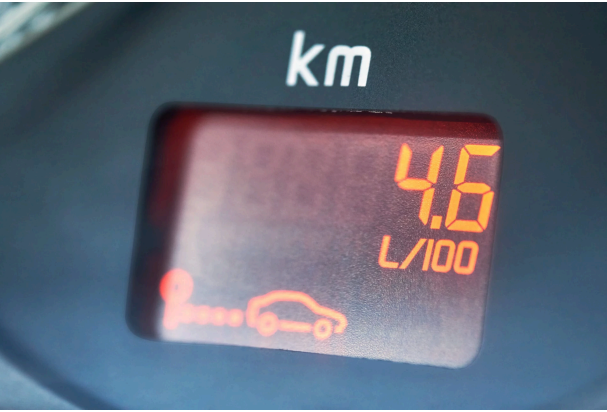
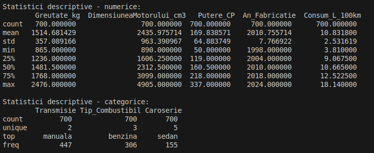
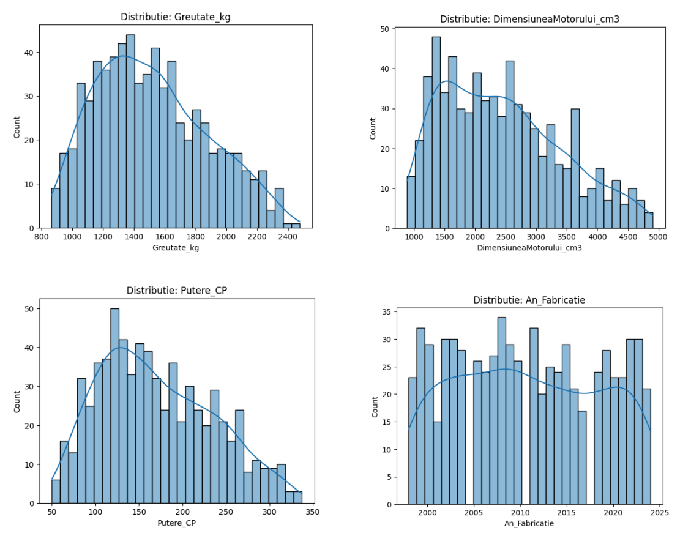
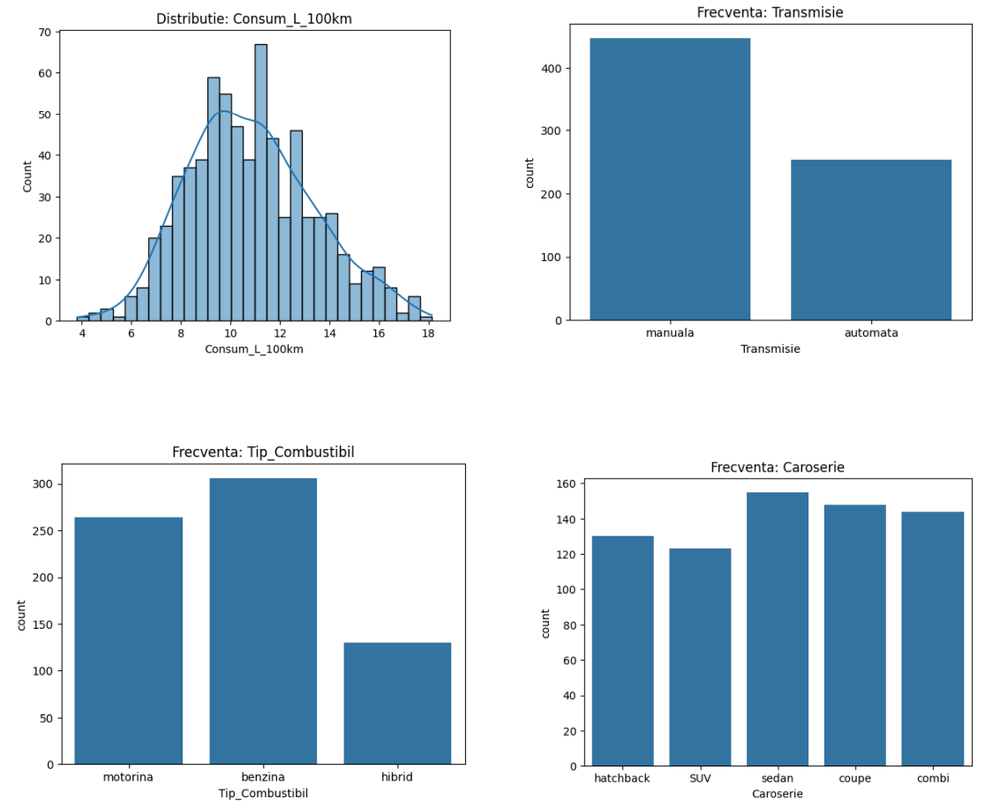
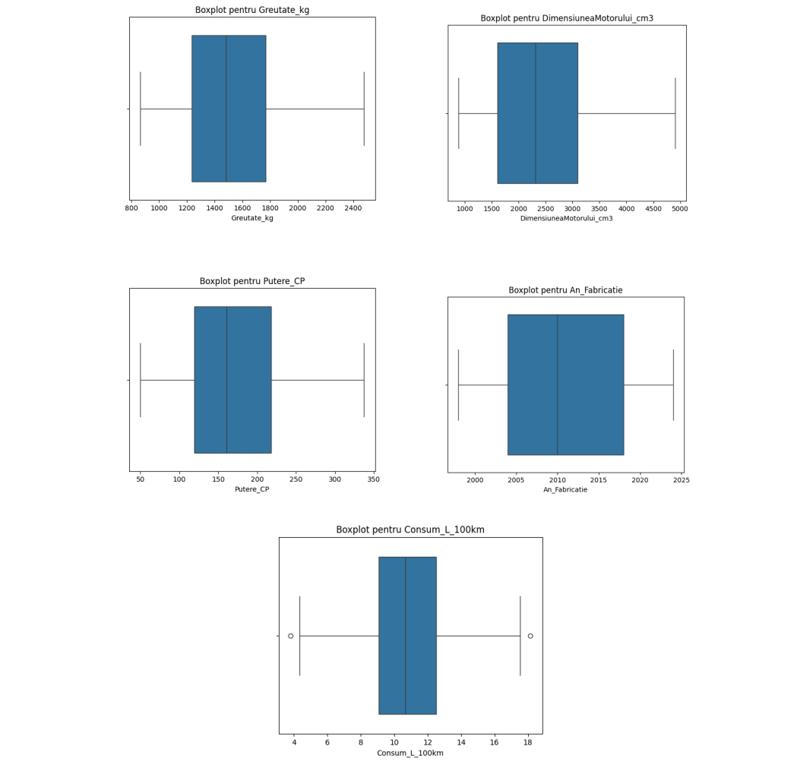
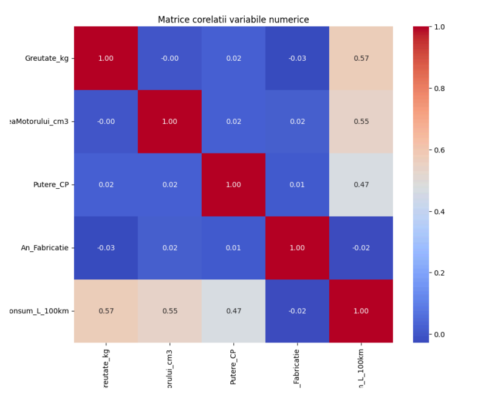
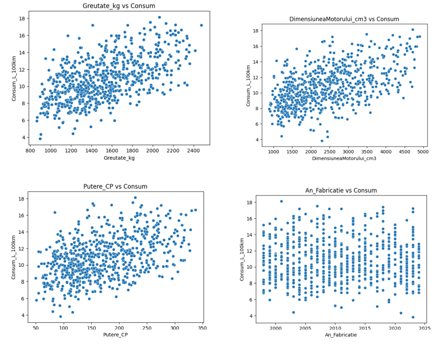
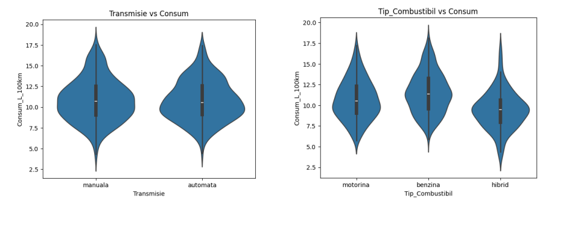
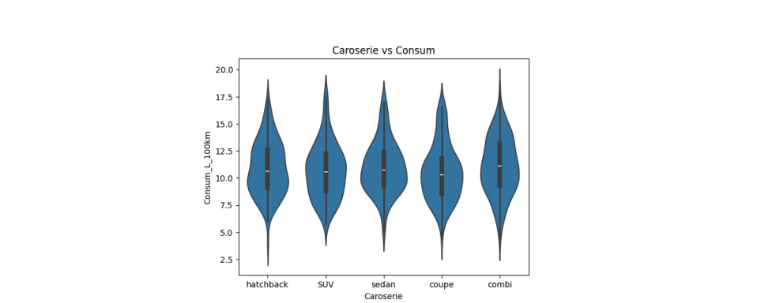
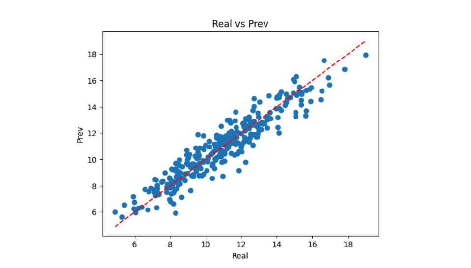

# Construirea si explorarea unui dataset tabelar

Tema abordata este o **problema de regresie**, in care ne propunem sa prezicem **consumul (L/100km) al unei masini** pe baza unor caracteristici tehnice si structurale.

  

Am optat pentru generarea sintetica a datelor. Setul de date simuleaza caracteristici reale ale unor autoturisme:
- Greutate (kg)
- Dimensiunea motorului (cm³)
- Putere (CP)
- Tip transmisie (automata, manuala)
- Tip combustibil (benzina, motorina, hibride)
- Tip caroserie
- An fabricatie
- Consum estimat (variabila tinta)

## Observatii
- Codul este impartit in 2 fisiere diferite:
  - `gen_csv.py` ce genereaza propriu-zis fisierele `train.csv` si `test.csv`
  - `main.py` care contine EDA-ul si Antrenarea modelului
- Greutatea, puterea si dimensiunea motorului au fost generate folosind o distributie triangulara, concentrata spre valori mai mici, reflectand faptul ca majoritatea masinilor de pe piata sunt modele compacte sau medii.
- Consumul a fost calculat ca o funcție neliniară de greutate, motor, putere și combustibil, cu puțin zgomot aleator.
- Setul a fost impartit in:
  - `train.csv` – 700 exemple
  - `test.csv` – 300 exemple

---

## Analiza exploratorie a datelor

### Statistici descriptive

  

- Valorile variabilelor numerice sunt distribuite realist.
- Distributiile pentru variabile categorice sunt echilibrate, dar reflecta diversitate.

### Analiza distributiei variabilelor

  

  

- Histogramele arata asimetrie la “Greutate”, “Putere_CP” și “Dimensiunea Motorului”, asa cum am intentionat.
- Distribuția consumului este moderat normala, cu usoara intindere spre valorile mari.
- Se observa diferenta numerelor de exemplare pe motorina fata de benzina, la fel si cele manuale fata de cele automate.

### Detectarea outlierilor

  

- Exista cativa outlieri la “Putere_CP” și “Consum_L_100km”, dar acestia reflecta cazuri realiste (ex: SUV-uri puternice).

### Analiza corelatiilor

  

- Cea mai mare corelație cu consumul o au: “DimensiuneaMotorului” și “Greutate”.

### Analiza relatiilor cu variabila tinta

  

- Variabilele `Putere_CP`, `Greutate` și `Motor` cresc consumul.

  

  

- Masinile hibride au un consum evident mai mic (vizibil în graficele de tip violin plots).

---

## Antrenarea si evaluarea unui model de baza

A fost folosita Regresia Liniara din biblioteca Sklearn.

  

**Performantele modelului:**
- **MAE:** 0.6975887403249262
- **RMSE:** 0.8770958163161408
- **R2:** 0.8829641574855024